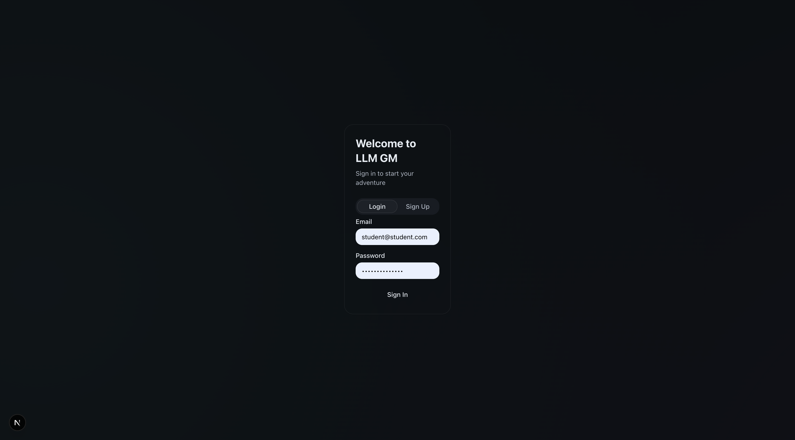
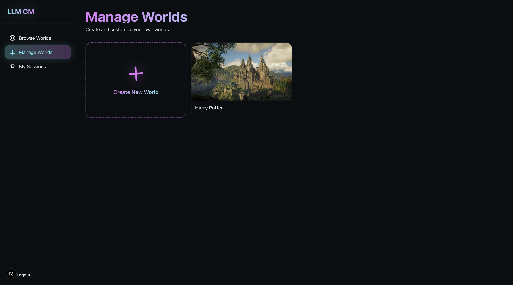
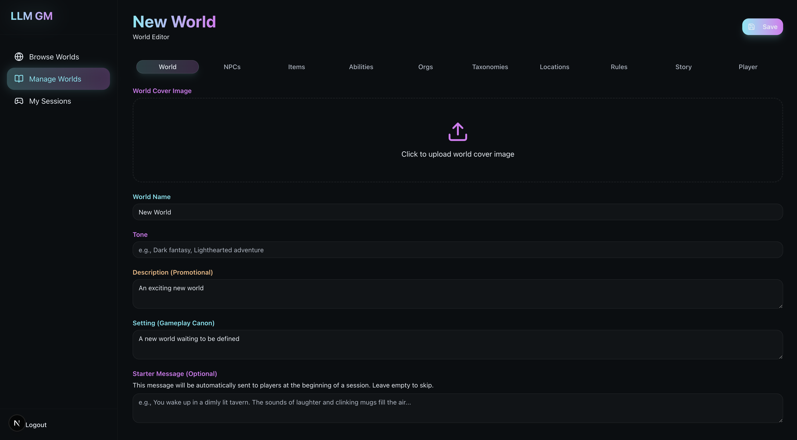
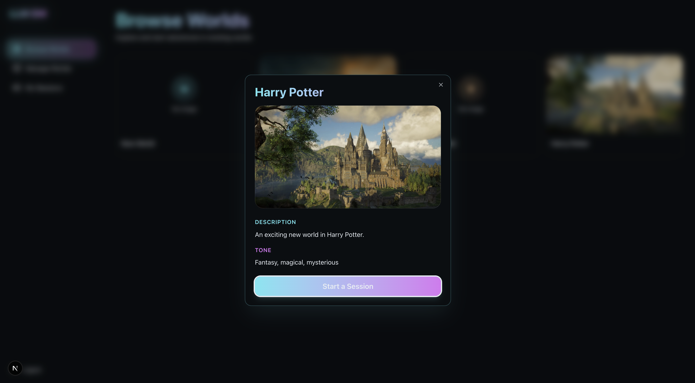
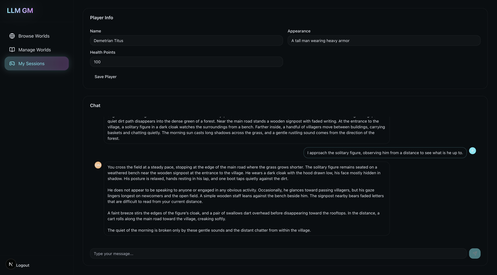

# LLLM-GM: Intelligent World and Story Management System for Tabletop Role-Playing Games

## Overview

LLM GM is an AI-powered interactive storytelling and game management platform that enables users to create immersive worlds and run dynamic game sessions. Built with Next.js, Supabase, and OpenAI, the platform leverages Large Language Models (LLMs) to act as a Game Master (GM), responding to player actions in real-time and managing game state intelligently.

The system features a comprehensive world-building toolkit where users can define NPCs, items, abilities, locations, and more. During gameplay, an advanced Retrieval-Augmented Generation (RAG) system selectively retrieves relevant game entities to provide context to the AI, ensuring coherent and contextually-aware responses while minimizing API costs.

## Codebase Layout

```
llm-gm/
├── app/
│   ├── api/
│   │   ├── dm-response/
│   │   │   ├── route.ts              API endpoint for DM response generation
│   │   │   ├── workflow.ts           Orchestrates the 7-step DM workflow
│   │   │   ├── prompts.ts            Prompt templates for LLM calls
│   │   │   └── nodes/                Individual workflow steps (1-7)
│   │   └── generate-embedding/
│   │       └── route.ts              API endpoint for vector embedding generation
│   ├── auth/
│   │   └── callback/
│   │       └── route.ts              OAuth callback handler
│   ├── browse/
│   │   └── page.tsx                  Browse and search worlds
│   ├── manage/
│   │   └── [id]/
│   │       └── page.tsx              World editor interface
│   ├── sessions/
│   │   └── [id]/
│   │       └── page.tsx              Live game session interface
│   ├── layout.tsx                    Root layout with auth provider
│   └── page.tsx                      Landing page
│
├── components/
│   ├── layout/
│   │   └── Navbar.tsx                Main navigation bar
│   ├── ui/                           Reusable UI components (shadcn/ui)
│   └── world-editor/
│       └── EntityEditor.tsx          Generic entity CRUD interface
│
├── contexts/
│   └── AuthContext.tsx               Authentication state management
│
├── experiments/
│   ├── function-calling.ts           Compares function calling vs SQL generation for field updates
│   ├── rag_experiments.ipynb         Main RAG evaluation notebook (baseline, ablation studies)
│   ├── config.py                     Experiment parameters (thresholds, top-k values, runs)
│   ├── test_scenarios.json           Test cases for RAG experiments
│   ├── add_entities.py               Helper to populate test world with entities
│   └── utils/
│       ├── rag_simulator.py          Simulates RAG retrieval for testing
│       └── metrics.py                Calculates token usage, latency, cost metrics
│
├── lib/
│   ├── supabase/
│   │   ├── client.ts                 Browser Supabase client
│   │   └── server.ts                 Server-side Supabase client
│   └── database.types.ts             TypeScript types generated from database schema
│
├── migrations/                       Run in order in Supabase SQL Editor
│   ├── 001_extensions.sql            Enable pgvector and ltree extensions
│   ├── 002_worlds.sql                Core worlds table
│   ├── 003-020_*.sql                 Entity tables (items, NPCs, locations, abilities, etc.)
│   ├── 021_storage_setup.sql         Image upload storage buckets
│   └── 022_rag_vector_search.sql     Vector similarity search functions for RAG
│
└── scripts/
    └── generate-embeddings.ts        Batch generate embeddings for existing entities
```

## Testing

The project includes comprehensive testing across multiple levels:

### Unit & Integration Tests

- **Unit Tests**: Component and utility function tests
  - `components/ui/card.test.tsx` - UI component tests
  - `lib/utils.test.ts` - Utility function tests

- **Integration Tests**: Database and API integration tests
  - `lib/supabase.integration.test.ts` - Supabase database operations

Run tests with:
```bash
npm test
```

### Experimental Research

The project includes two main experimental frameworks for evaluating system performance:

#### 1. RAG System Experiments (Python)

**Main Files:**
- `experiments/rag_experiments.ipynb`
- `experiments/config.py`
- `experiments/test_scenarios.json`
- `experiments/requirements.txt`

**Purpose:** Evaluate RAG system performance against baselines (No RAG, Random Sampling) and conduct ablation studies.

**Setup:**
```bash
cd experiments
pip install -r requirements.txt
jupyter notebook rag_experiments.ipynb
```

**What it tests:**
- Baseline comparison: No RAG vs Random Sampling vs RAG
- RAG threshold ablation (0.5, 0.65, 0.8)
- Top K ablation (3, 5, 10 entities)
- Temperature ablation (0.5, 0.8, 1.0)

**Results:** Generated in `experiments/results/` (CSV files, plots, statistical analysis)

#### 2. Function Calling Experiment (TypeScript)

**Main File:**
- `experiments/function-calling.ts`

**Purpose:** Compare LLM function calling approach vs SQL generation for dynamic player field updates.

**Run:**
```bash
npm run experiment [numTrials]
# Example: npm run experiment 5
```

**What it tests:**
- Function calling approach (OpenAI tools)
- SQL generation approach
- Token usage and latency comparison

**See `experiments/README.md` for detailed experiment documentation.**

## Setup

### Prerequisites

- Node.js 18 or higher
- A Supabase account
- An OpenAI API key

### Installation Steps

1. **Clone the repository**
   ```bash
   git clone <repository-url>
   cd llm-gm
   ```

2. **Install dependencies**
   ```bash
   npm install
   ```

3. **Create a Supabase account and project**
   - Go to [supabase.com](https://supabase.com)
   - Create a new account if you don't have one
   - Create a new project
   - Wait for the project to finish provisioning

4. **Configure environment variables**
   - Copy `.env.example` to `.env`:
     ```bash
     cp .env.example .env
     ```
   - Open `.env` and fill in your credentials:
     - `NEXT_PUBLIC_SUPABASE_URL`: Your Supabase project URL (found in Project Settings > API)
     - `NEXT_PUBLIC_SUPABASE_ANON_KEY`: Your Supabase anon/public key (found in Project Settings > API)
     - `OPENAI_API_KEY`: Your OpenAI API key (from [platform.openai.com](https://platform.openai.com))

5. **Run database migrations**
   - Go to your Supabase project dashboard
   - Navigate to the SQL Editor
   - Run each migration file in the `migrations/` folder **in numerical order**:
     1. `001_extensions.sql`
     2. `002_worlds.sql`
     3. `003_abilities.sql`
     4. Continue through all files...
     5. `022_rag_vector_search.sql` (critical for RAG functionality)

   **Note**: You must run the migrations in order as later migrations depend on earlier ones.

## Running the App

Start the development server:

```bash
npm run dev
```

Open [http://localhost:3000](http://localhost:3000) in your browser.

For production build:

```bash
npm run build
npm start
```

## Usage Guide

### Step 1: Create an Account and Login



- Navigate to the homepage
- Click "Sign Up" to create a new account
- Enter your email and password, or sign in with Google
- After signing up, log in with your credentials

---

### Step 2: Create a New World



- Once logged in, click "Create World" from the navigation bar
- You'll be taken to the world editor interface
- The world editor allows you to define all aspects of your game world

---

### Step 3: Fill in World Information



- **World Settings Tab**: Define the world's name, setting, and description
- **Entities Tabs**: Add game entities across multiple categories:
  - NPCs: Non-player characters
  - Items: Objects and equipment
  - Abilities: Skills and powers
  - Locations: Places in your world (supports hierarchical organization)
  - Organizations: Factions and groups
  - Taxonomies: Classification systems
  - Rules: Game mechanics and world rules
  - Story Nodes: Plot points and narrative elements
  - Player Fields: Custom attributes for player characters (e.g., Health, Mana)
- Save your changes as you go

---

### Step 4: Start a Session



- Navigate to "Browse Worlds" from the navigation bar
- Find the world you created in the list
- Click "Start Session" on your world card
- Fill in your player character details:
  - Character name
  - Character appearance
  - Initial values for any custom player fields
---

### Step 5: Play



- You'll enter the interactive game session interface
- The AI Game Master will respond to your actions
- Type your actions in the chat box and press Enter
- The AI will:
  - Narrate what happens based on your actions
  - Update your character's fields automatically (e.g., reduce health when damaged)
  - Reference relevant NPCs, items, and locations from your world
  - Maintain consistency with world rules and lore
- Your player fields are displayed on the right side and update in real-time
- Continue playing by describing what your character does

---

## Troubleshooting

### Common Issues

**Problem**: "Failed to connect to Supabase"
- **Solution**: Verify that your `NEXT_PUBLIC_SUPABASE_URL` and `NEXT_PUBLIC_SUPABASE_ANON_KEY` are correctly set in `.env`
- Make sure there are no extra spaces or quotes in the `.env` file

**Problem**: "OpenAI API error" or "Failed to generate response"
- **Solution**: Check that your `OPENAI_API_KEY` is valid and has available credits
- Verify the key is correctly copied into `.env` with no extra characters

**Problem**: Database queries failing or tables not found
- **Solution**: Ensure all migrations were run in order
- Go to Supabase SQL Editor and verify tables exist
- Re-run any missing migrations

**Problem**: Vector search not working or embeddings failing
- **Solution**: Make sure migration `022_rag_vector_search.sql` was executed
- Verify the `pgvector` extension is enabled (check `001_extensions.sql`)

**Problem**: Can't see my worlds or sessions
- **Solution**: Check that you're logged in with the correct account
- Verify Row Level Security (RLS) policies were created by the migrations
- Check browser console for any authentication errors

**Problem**: Images not uploading
- **Solution**: Verify migration `021_storage_setup.sql` was run
- Check that storage buckets were created in your Supabase project
- Ensure file size is under the limit (usually 50MB)

### Getting Help

If you encounter issues not covered here:
1. Check the browser console (F12) for error messages
2. Review the terminal output for server-side errors
3. Verify all environment variables are set correctly
4. Ensure all migrations completed successfully
5. Check that your Supabase project is active and not paused
